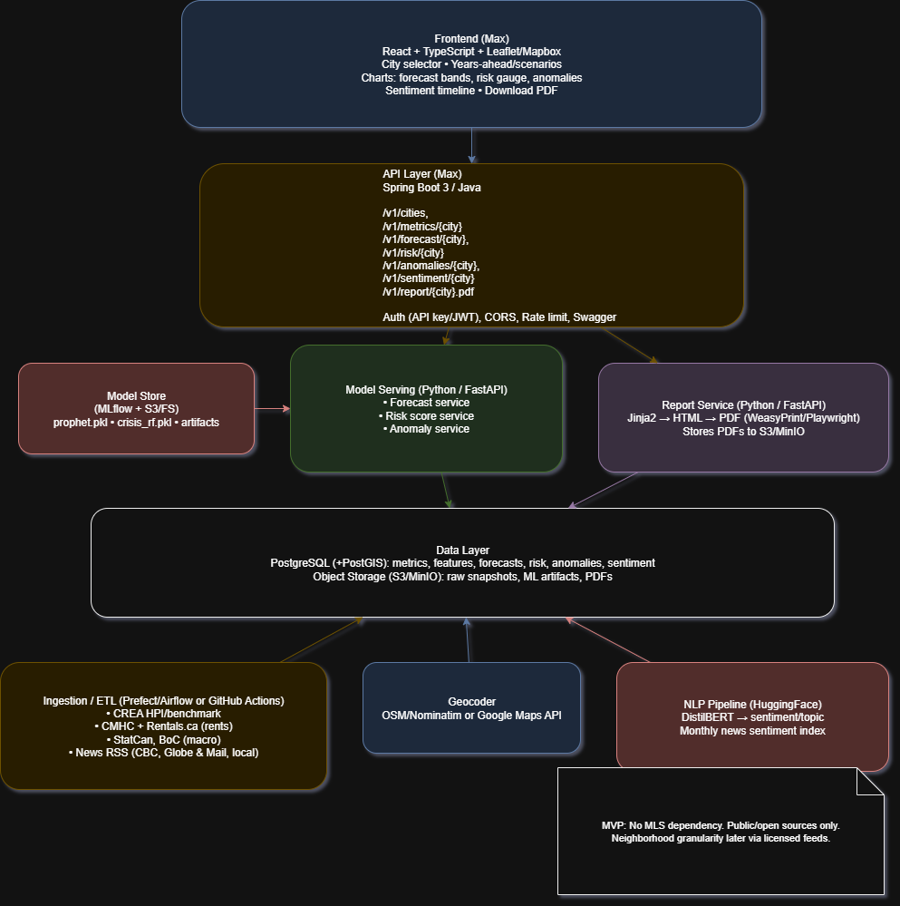

# 🏗 System Architecture

The Housing Insights + Risk Dashboard MVP is composed of five main layers:

---

## 1. Frontend (React/TypeScript)

- Owner: Max
- Built with React + TypeScript + Vite
- Features:
  - City selector (Kelowna, Vancouver, Toronto)
  - Charts: forecast bands, risk gauge, anomalies
  - Sentiment timeline
  - PDF download button

---

## 2. API Layer (Spring Boot 3 / Java)

- Owner: Max
- Responsibilities: serve housing forecasts, risk indicators, anomalies, sentiment, and reports.
- Endpoints:
  - `/v1/cities`
  - `/v1/forecast/{city}`
  - `/v1/risk/{city}`
  - `/v1/anomalies/{city}`
  - `/v1/sentiment/{city}`
  - `/v1/report/{city}.pdf`
- Features:
  - Authentication (API key/JWT)
  - CORS, rate limiting
  - Swagger/OpenAPI documentation

---

## 3. Model Layer (Python / FastAPI)

- Owner: Yuri
- Services:
  - Forecasting (Prophet, LightGBM)
  - Risk similarity classifier (Random Forest / Logistic Regression)
  - Anomaly detection (Isolation Forest)
- Model artifacts stored in MinIO (S3FS layout)

---

## 4. Reporting Layer (Python / FastAPI)

- Owner: Yuri
- Pipeline: Jinja2 → HTML → PDF (WeasyPrint/Playwright)
- Responsibilities:
  - Generate 2-page reports (Forecast + Risk)
  - Store PDFs in MinIO with versioned filenames

---

## 5. Data Layer

- PostgreSQL + PostGIS → stores metrics, features, forecasts, risk scores, anomalies, sentiment
- MinIO (S3-compatible) → raw data snapshots, ML artifacts, PDF reports

---

## 6. Data Ingestion & NLP

- ETL pipelines:
  - CREA (HPI benchmark)
  - CMHC + Rentals.ca (rents)
  - StatCan + Bank of Canada (macro)
  - News RSS feeds (CBC, Globe & Mail, local)
- NLP pipeline: HuggingFace DistilBERT → daily sentiment index

---

## 📊 Architecture Diagram

---

## Design Principles

- Separation of concerns: ML in Python, serving in Java, UI in React
- Reproducibility: versioned data and artifacts in MinIO
- Accessibility: API-first with OpenAPI schema
- Portability: one-command demo with Docker Compose
